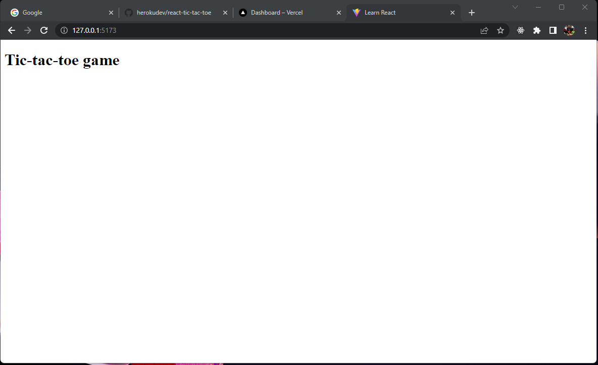

# TIC-TAC-TOE

## About

This app is a classic game that allows to show basic concepts about the use of the Reactjs library.

Below, we showcase screenshot of the app.

<p align="center">
    
</p>

## Built With

- REACT, CSS, JavaScript;
- VisualStudio Code, Git, & GitHub;

## Pre-requisites

- Visual Studio Code
- Git

## Live Demo

Live demo for this project can be found if you [click here](#).

## Getting Started

To run this project, you only need a computer with internet connection and a browser installed, and follow these steps:


1. In your terminal, in the folder of your preference, type the following bash command to clone this repository:

```sh
git https://github.com/herokudev/react-tic-tac-toe.git
```

2. Now that you have already cloned the repo run the following commands to get the project up and running:
```sh
cd tic-tac-toe
npm install
npm run dev
```
In the browser of your choice you must open the url on terminal details (ex.   ➜  Local:   http://127.0.0.1:5173/)

## Author

👤 **Herbert Orellana**

- GitHub: [@herokudev](https://github.com/herokudev)
- Twitter: [@HerbertOrellan4](https://twitter.com/HerbertOrellan4)
- LinkedIn: [LinkedIn](https://www.linkedin.com/in/herbert-orellana/)


## 🤝 Contributing

Contributions, issues, and feature requests are welcome!

Feel free to check the [issues page](https://github.com/herokudev/funval-splitter/issues).

## Show your support

Give a ⭐️ if you like this project!

## 📝 License

This project is [MIT](./LICENSE) licensed.
